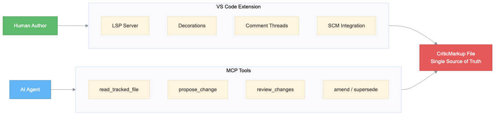
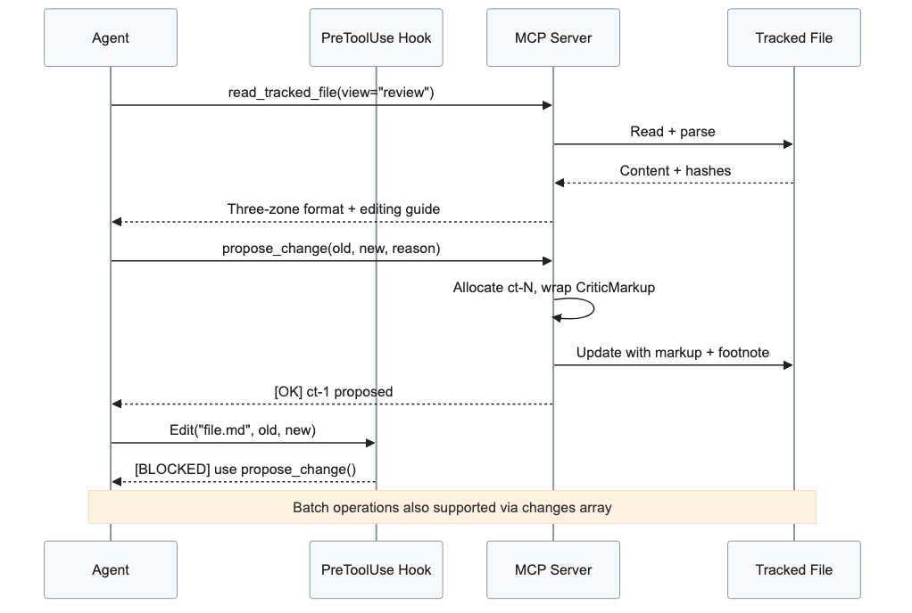

<!-- changedown.com/v1: tracked -->

**ChangeDown {++c++}[^cn-1]{--C--}[^cn-2]ollaborative Editing Powered by CriticMarkup**[^cn-3]

*By: Sarah Chen, Product Lead – ChangeDown*

*James Rivera, Engineering – ChangeDown*

*Maya Patel, Documentation – ChangeDown*[^cn-4]

**{--Introduction--}[^cn-5]**

When teams collaborate on documents, they are not thinking about the underlying technology {~~—~>—~~}[^cn-6] they just want their edits tracked reliably and attributed correctly.

But {--most--}[^cn-7] document editing workflows face a familiar challenge: you have invested in {++sophisticated++}[^cn-8] {++AI agents++}[^cn-9] that can draft, revise, and restructure content, yet they {--bypass--}[^cn-10] every editorial safeguard your team depends on {--—--}[^cn-11] {~~~>—~~}[^cn-12]Edits arrive without {~~attribution~>attribution~~}[^cn-13]. Revisions overwrite previous work with no {~~record~>record~~}[^cn-14]. Reviewers discover changes only by diffing file versions after the fact{++,++}[^cn-15] {--—--}[^cn-16] reconstructing context from commit messages that rarely explain why a particular sentence was reworded or a paragraph reorganized.

That is why ChangeDown and {++the CriticMarkup open standard++}[^cn-17] took a different approach{++.++}[^cn-18] {~~:~>Every edit is~~}[^cn-19] {--captured--}[^cn-20] inline, attributed to {~~its~>its~~}[^cn-21] author, with a reason attached.

The new {~~open-source~>open source~~}[^cn-22] {++CriticMarkup++}[^cn-23] connector for markdown editors gives teams a bring-your-own-vocabulary approach to change tracking. Rather than forcing a proprietary format, the connector maps every insertion, deletion, substitution{--,--}[^cn-24] {--"--}[^cn-25]highlight{~~"~>and comment~~}[^cn-26] to standard CriticMarkup delimiters that any text editor can render. This means organizations can integrate change tracking into their existing markdown pipelines without vendor lock-in, using the same files across VS Code, GitHub, static site generators, and documentation build systems that already process plain text natively{--,--}[^cn-27] while maintaining full editorial accountability.

For the {++more than++}[^cn-28] 10,000{--+--}[^cn-29] organizations running collaborative document workflows today, this integration delivers a practical path to tracked AI editing. Teams in {~~North America, Europe, and the Asia-Pacific region~>North America, Europe, and the Asia-Pacific region~~}[^cn-30] {++can++}[^cn-31] connect {++their++}[^cn-32] existing markdown toolchains to ChangeDown without replacing their current editors or revision control systems{--+--}[^cn-33].

Here is how the integration works, where it fits across collaborative editing workflows, and what measurable improvements organizations report from deploying tracked change management.

**{~~ChangeDown Integration Architecture and Design~>ChangeDown~~}[^cn-34] {++integration++}[^cn-35] {++architecture and design++}[^cn-36]**

This integration connects your markdown editing environment to open-source CriticMarkup services through a {~~layered~>layered~~}[^cn-37] architecture designed for extensibility and reliability. {++The architecture comprises three integrated layers:++}[^cn-38]

{--F--}[^cn-39]{--igure--}[^cn-40] {--1--}[^cn-41] {--shows the component architecture for the ChangeDown integration, illustrating how the VS Code extension, the MCP tool server, and the CriticMarkup parser work together to deliver tracked changes.--}[^cn-42]

{----}[^cn-43]

{--**Figure 1:** ChangeDown extension integration with CriticMarkup services--}[^cn-44]

{--The architecture comprises three integrated layers:--}[^cn-45]

- **Editor** {--**interaction layer**--}[^cn-46] **interaction layer:** {++–++}[^cn-47] The VS Code extension captures every keystroke and cursor movement, accumulating edits into boundary-delimited change operations that wrap automatically in {--CriticMarkup (--}[^cn-48]CriticMarkup{~~)~>(CM)~~}[^cn-49] syntax before writing each attributed change to the file.
- **Connector layer:** {++–++}[^cn-50] The {~~open-source~>open source~~}[^cn-51] MCP tool server bridges AI agents to the same CriticMarkup format, translating propose_change calls into attributed edit operations with full metadata.
- **AI agent** {++**layer**++}[^cn-52] {~~**layer:**~>–~~}[^cn-53] Large language models and other AI agents interact with tracked files through the MCP tool server, generating context-aware edit proposals that reference LINE:HASH coordinates. The connector validates each proposal against the current file state before committing attributed changes to the {++CriticMarkup record using++}[^cn-54] {++the++}[^cn-55]{~~six-level matching cascade~>six-level matching cascade~~}[^cn-56]. Metadata extraction is handled by {++the footnote-native parser++}[^cn-57], delivering structured metadata extraction for attributed review responses.

{++This arc++}[^cn-58]{++hitecture is illustrated in the following NEEDS ACTION: replace with actual figure reference diagram++}[^cn-59]{++.++}[^cn-60]

{++++}[^cn-61]

{++*Figure 1: ChangeDown extension integration with CriticMarkup services overview*++}[^cn-62]

**{--How an--}[^cn-63] Agent {~~E~>e~~}[^cn-64]diting {~~F~>f~~}[^cn-65]low{--s End-to-End--}[^cn-66]**

{----}[^cn-67]

{--**Figure 2:** ChangeDown Agent Editing and Review Integration Call flow--}[^cn-68]

When an agent connects to a tracked file in the editing environment, the following flow takes place:[^cn-69]

1. **Agent reads file state** {~~-~>–~~}[^cn-70] The agent reads the current file state through the MCP read_tracked_file tool, which returns every line with its LINE:HASH coordinate. The agent receives the full document context including pending changes, author metadata, and review status for each {--tracked--}[^cn-71] {~~operation~>tracked operation~~}[^cn-72].
2. **Parser interprets intent** {++–++}[^cn-73] {-----}[^cn-74] {~~The CriticMarkup parser~>The CriticMarkup parser~~}[^cn-75] processes the request and identifies the appropriate editing action from the agent instructions through three stages:
   1. **Change Detection:** {++–++}[^cn-76] {--The edit boundary engine detects keystroke sequences and cursor movements, segmenting them into discrete change operations for the tracking pipeline (--}[^cn-77]supporting{--)--}[^cn-78] {++thousands of++}[^cn-79] {--concurrent--}[^cn-80] editing sessions
   2. **Intent Understanding:** {++–++}[^cn-81] {--The footnote-native parser maps recognized text to editing intents such as insert, delete, substitute, highlight, and comment operations with full author (--}[^cn-82]attribution{--)--}[^cn-83]{--,--}[^cn-84] now enhanced with {~~LLM-powered contextual intent classification~>LLM-powered contextual intent classification~~}[^cn-85] for faster, description-based intent classification
   3. **Response Generation:** {++–++}[^cn-86] For straightforward requests, {~~the MCP tool server~>the MCP tool server~~}[^cn-87] generates a direct response using its built-in propose_change fulfillment. For complex editing tasks requiring document context, {~~the system~>the system~~}[^cn-88] routes to large language models (such as Claude) {++for nuanced revision proposals++}[^cn-89] that respect existing tracked changes{++.++}[^cn-90]

{--This architecture supports multi-turn conversations with contextual awareness, so an agent can reference earlier edits in the same session and build on previous review decisions.--}[^cn-91]

3. **Response flows back** {++–++}[^cn-92] {-----}[^cn-93] The MCP tool server formulates the edit proposal and routes it through the CriticMarkup parser for validation and serialization. The response includes fully attributed change operations with LINE:HASH coordinates. {~~The parser~>The parser~~}[^cn-94] {~~supports~>supports the~~}[^cn-95] {~~six-level matching cascade~>six-level matching cascade~~}[^cn-96] for fine-grained control over {++anchor resolution, whitespace normalization, and settled-text fallback (++}[^cn-97]STF{++)++}[^cn-98] in ambiguous contexts. The response flows back through the connector to the editor {~~via~>using~~}[^cn-99] the CriticMarkup protocol.
4. **Escalation when needed** {++–++}[^cn-100] {-----}[^cn-101] If the virtual agent {~~cannot~>can't~~}[^cn-102] resolve the editing request — for example, when a proposed substitution conflicts with a pending change from another author — the system escalates to a human reviewer. The escalation preserves the full dialog{--ue--}[^cn-103] context so the reviewer can pick up without repeating steps.

{++This architecture supports multiturn conversations with contextual awareness, allowing agents to reference earlier edits and build on previous review decisions within the same session.++}[^cn-104]

{++The agent editing flow is illustrated in the following flow diagram.++}[^cn-105]

{++++}[^cn-106]

{++*Figure 2: ChangeDown agent editing environment and review integration call flow*++}[^cn-107]

{~~How t~>T~~}[^cn-108]his solution integrates with your editing environment {++in the following ways for collaborative workflows.++}[^cn-109]

- **CriticMarkup services:** {++–++}[^cn-110] The CriticMarkup parser handles {--change detection and edit-boundary segmentation, while the footnote-native parser provides structured metadata extraction for attributed review (--}[^cn-111]responses{--)--}[^cn-112] and {--agentic developer tools provide the orchestration framework for agent-driven editing workflows with full LINE:HASH (--}[^cn-113]addressing{--)--}[^cn-114]. The parser resolves ambiguous anchors using {~~the six-level matching cascade~>the matching cascade~~}[^cn-115].
- **Agentic developer tools:** {++–++}[^cn-116] The MCP tool server provides the orchestration framework for agent-driven editing workflows with full LINE:HASH addressing.
- **Generative AI with** {++**large language**++}[^cn-117] **models:** {++–++}[^cn-118] Large language models power context-aware edit generation — {~~the model reads full document state~>the model reads full document state~~}[^cn-119] via read_tracked_file before proposing {~~attributed changes~>attributed changes,~~}[^cn-120] {--—--}[^cn-121]enabling responses that go beyond scripted intents.

**Why this design matters**

- **Your files, your rules.** The ChangeDown {~~extension~>extension~~}[^cn-122] runs entirely in your own editor, giving you full control over customization, data retention, and compliance.
- **Built for performance.** Designed for responsive, real-time change tracking with minimal editor overhead.
- **Secure by design.** Local-first processing means your document data stays in your infrastructure at all times.
- **Deploy where you need.** Available as an open source extension supporting global teams{++, with local-first++}[^cn-123] processing and no cloud dependency for all supported editing operations.[^cn-124]

**Use cases across collaborative workflows**

{++Organizations++}[^cn-125] {++across industries can find benefits in pursuing tracked, AI-assisted document management solutions.++}[^cn-126]

{--**Healthcare:**--}[^cn-127]

{++Healthcare organizations can++}[^cn-128] enhance clinical documentation with intelligent template management, automated discharge summary drafting, and smart protocol routing that assigns revisions to the right specialist while maintaining comprehensive audit trails of every clinical document {--change--}[^cn-129] revision.

{--**Finance:**--}[^cn-130]

{++Finance organizations can++}[^cn-131] improve document self-service in situations like regulatory filing preparation, contract revision tracking, and compliance report generation, all while maintaining the strict change attribution and editorial audit trails that financial regulators require for audit readiness and operational {~~transparency~>transparency~~}[^cn-132].[^cn-133]

{--**Government:**--}[^cn-134]

Government agencies can streamline policy document workflows with full change attribution, supporting inter-agency review processes with tracked revisions for benefit enrollment guides, permit application forms, and public records documentation.[^cn-135]

**Workflow benefits**

{--**Editorial workflow automation:**--}[^cn-136]

{----}[^cn-137]Tracked AI editing transforms routine document revisions{++, including++}[^cn-138] {--—--}[^cn-139]content updates, structural reorganization, and style corrections, into streamlined self-service experiences. The integration delivers consistent editorial quality around the clock and scales to handle revision volume spikes without adding headcount or compromising review quality. The result{~~:~>is~~}[^cn-140] consistent, quality support available {~~24/7~>around the clock~~}[^cn-141] without proportional staffing costs.

|     | **Step**              | **Traditional {++p++}[^cn-142]{--P--}[^cn-143]rocess**                                        | **With {~~integration~>ChangeDown integration~~}[^cn-144] {++i++}[^cn-145]{--I--}[^cn-146]ntegration**                                                                    |
| --- | --------------------- | -------------------------------------------------------------- | --------------------------------------------------------------------------------------- |
| 1   | Author initiates edit | Opens file, makes changes without attribution (4{++–++}[^cn-147]{-----}[^cn-148] {~~min~>minute~~}[^cn-149] no audit trail) | Instant change tracking with author metadata {~~via~>using~~}[^cn-150] LINE:HASH coordinates (under 1 second)           |
| 2   | Review                | Reviewer manually diffs versions (2{~~-~>–~~}[^cn-151]3 min per file)           | {~~ChangeDown~>ChangeDown~~}[^cn-152] presents inline changes with author, date, and reason in sec{++onds++}[^cn-153]           |
| 3   | Resolution            | 8{++–++}[^cn-154]{-----}[^cn-155]12 minute review cycle                               | 2{++–++}[^cn-156]{-----}[^cn-157]4 minute resolution with full context preserved                        |

Similar efficiency gains apply to content migration and multi-author consolidation workflows across all supported editing environments.

{--**Personalized editorial engagement:**--}[^cn-158]

{--The CriticMarkup matching cascade's--}[^cn-159] {~~contextual editing~>contextual editing capabilities in the CriticMarkup matching cascade~~}[^cn-160] enables genuine contextual editing experiences. The system recognizes returning authors{--,--}[^cn-161]{++;++}[^cn-162] it references their change history{~~:~>. It~~}[^cn-163] recogniz{++es++}[^cn-164]{--ing--}[^cn-165] returning authors, referenc{++es++}[^cn-166]{--ing--}[^cn-167] their change history, and anticipat{++es++}[^cn-168]{--ing--}[^cn-169] revision patterns based on previous edits. This intelligent, empathetic approach builds loyalty by making every author feel known, not processed.

**{--Summary/--}[^cn-170]Conclusion**

In today's collaborative editing deployments, organizations face a definitive challenge{++.++}[^cn-171]{~~:~>The need to address h~~}[^cn-172]{--H--}[^cn-173]ow to scale AI-assisted document workflows without sacrificing the editorial accountability that reviewers and compliance teams require. Through the {~~open-source~>open source~~}[^cn-174] CriticMarkup connector, combined with the MCP tool server and VS Code extension, delivers a production-ready solution.

Organizations implementing this {--Open-source--}[^cn-175]{++o++}[^cn-176]{++pen source++}[^cn-177] {~~integration~>CriticMarkup integration~~}[^cn-178] gain measurable advantages in editorial throughput{--,--}[^cn-179] review quality, and document integrity. This solution integrates with proven {~~CriticMarkup~>open source~~}[^cn-180] standards to improve every interaction and maintain context and intent across complete conversations{++,++}[^cn-181] {--that--}[^cn-182] improv{~~es~>ing~~}[^cn-183] your editorial experience.

Ready to transform your collaborative editing strategy? {++Connect with the ChangeDown++}[^cn-184] open source community {++to design a deployment architecture++}[^cn-185] tailored to your specific editorial workflow requirements.[^cn-186]

[^cn-1]: @editor | 2026-03-21 | ins | proposed

[^cn-2]: @editor | 2026-03-21 | del | proposed

[^cn-3]: @editor | 2026-03-21 | comment | proposed
    @editor 2026-03-21: This post was copyedited for grammar, spelling, capitalization, punctuation, terminology, and consistency issues. Other important issues are noted in comments, and you should consider revising the content accordingly before publication.

[^cn-4]: @editor | 2026-03-21 | comment | proposed
    @editor 2026-03-21: **NEEDS ACTION:** Please add byline information following the format provided

[^cn-5]: @editor | 2026-03-21 | del | proposed

[^cn-6]: @editor | 2026-03-21 | sub | proposed

[^cn-7]: @editor | 2026-03-21 | del | proposed

[^cn-8]: @editor | 2026-03-21 | ins | proposed

[^cn-9]: @editor | 2026-03-21 | ins | proposed

[^cn-10]: @editor | 2026-03-21 | del | proposed

[^cn-11]: @editor | 2026-03-21 | del | proposed

[^cn-12]: @editor | 2026-03-21 | sub | proposed

[^cn-13]: @editor | 2026-03-21 | sub | proposed

[^cn-14]: @editor | 2026-03-21 | sub | proposed

[^cn-15]: @editor | 2026-03-21 | ins | proposed

[^cn-16]: @editor | 2026-03-21 | del | proposed

[^cn-17]: @editor | 2026-03-21 | ins | proposed

[^cn-18]: @editor | 2026-03-21 | ins | proposed

[^cn-19]: @editor | 2026-03-21 | sub | proposed

[^cn-20]: @editor | 2026-03-21 | del | proposed

[^cn-21]: @editor | 2026-03-21 | sub | proposed

[^cn-22]: @editor | 2026-03-21 | sub | proposed

[^cn-23]: @editor | 2026-03-21 | ins | proposed

[^cn-24]: @editor | 2026-03-21 | del | proposed

[^cn-25]: @editor | 2026-03-21 | del | proposed

[^cn-26]: @editor | 2026-03-21 | sub | proposed

[^cn-27]: @editor | 2026-03-21 | del | proposed

[^cn-28]: @editor | 2026-03-21 | ins | proposed

[^cn-29]: @editor | 2026-03-21 | del | proposed

[^cn-30]: @editor | 2026-03-21 | sub | proposed

[^cn-31]: @editor | 2026-03-21 | ins | proposed

[^cn-32]: @editor | 2026-03-21 | ins | proposed

[^cn-33]: @editor | 2026-03-21 | del | proposed

[^cn-34]: @editor | 2026-03-21 | sub | proposed

[^cn-35]: @editor | 2026-03-21 | ins | proposed

[^cn-36]: @editor | 2026-03-21 | ins | proposed

[^cn-37]: @editor | 2026-03-21 | sub | proposed

[^cn-38]: @editor | 2026-03-21 | ins | proposed

[^cn-39]: @editor | 2026-03-21 | del | proposed

[^cn-40]: @editor | 2026-03-21 | del | proposed

[^cn-41]: @editor | 2026-03-21 | del | proposed

[^cn-42]: @editor | 2026-03-21 | del | proposed

[^cn-43]: @editor | 2026-03-21 | del | proposed
    image-dimensions: 4.5in x 1.125in

[^cn-44]: @editor | 2026-03-21 | del | proposed

[^cn-45]: @editor | 2026-03-21 | del | proposed

[^cn-46]: @editor | 2026-03-21 | del | proposed

[^cn-47]: @editor | 2026-03-21 | ins | proposed

[^cn-48]: @editor | 2026-03-21 | del | proposed

[^cn-49]: @editor | 2026-03-21 | sub | proposed

[^cn-50]: @editor | 2026-03-21 | ins | proposed

[^cn-51]: @editor | 2026-03-21 | sub | proposed

[^cn-52]: @editor | 2026-03-21 | ins | proposed

[^cn-53]: @editor | 2026-03-21 | sub | proposed

[^cn-54]: @editor | 2026-03-21 | ins | proposed

[^cn-55]: @editor | 2026-03-21 | ins | proposed

[^cn-56]: @editor | 2026-03-21 | sub | proposed

[^cn-57]: @editor | 2026-03-21 | ins | proposed

[^cn-58]: @editor | 2026-03-21 | ins | proposed

[^cn-59]: @editor | 2026-03-21 | ins | proposed

[^cn-60]: @editor | 2026-03-21 | ins | proposed

[^cn-61]: @editor | 2026-03-21 | ins | proposed
    image-dimensions: 4.5in x 1.125in

[^cn-62]: @editor | 2026-03-21 | ins | proposed

[^cn-63]: @editor | 2026-03-21 | del | proposed

[^cn-64]: @editor | 2026-03-21 | sub | proposed

[^cn-65]: @editor | 2026-03-21 | sub | proposed

[^cn-66]: @editor | 2026-03-21 | del | proposed

[^cn-67]: @editor | 2026-03-21 | del | proposed
    image-dimensions: 4.5in x 2.25in

[^cn-68]: @editor | 2026-03-21 | del | proposed

[^cn-69]: @editor | 2026-03-21 | comment | proposed
    @editor 2026-03-21: **NEEDS ACTION:** Lists need to be introduced with a sentence rather than a heading. I've added a suggestion. Please review for accuracy.

[^cn-70]: @editor | 2026-03-21 | sub | proposed

[^cn-71]: @editor | 2026-03-21 | del | proposed

[^cn-72]: @editor | 2026-03-21 | sub | proposed

[^cn-73]: @editor | 2026-03-21 | ins | proposed

[^cn-74]: @editor | 2026-03-21 | del | proposed

[^cn-75]: @editor | 2026-03-21 | sub | proposed

[^cn-76]: @editor | 2026-03-21 | ins | proposed

[^cn-77]: @editor | 2026-03-21 | del | proposed

[^cn-78]: @editor | 2026-03-21 | del | proposed

[^cn-79]: @editor | 2026-03-21 | ins | proposed

[^cn-80]: @editor | 2026-03-21 | del | proposed

[^cn-81]: @editor | 2026-03-21 | ins | proposed

[^cn-82]: @editor | 2026-03-21 | del | proposed

[^cn-83]: @editor | 2026-03-21 | del | proposed

[^cn-84]: @editor | 2026-03-21 | del | proposed

[^cn-85]: @editor | 2026-03-21 | sub | proposed

[^cn-86]: @editor | 2026-03-21 | ins | proposed

[^cn-87]: @editor | 2026-03-21 | sub | proposed

[^cn-88]: @editor | 2026-03-21 | sub | proposed

[^cn-89]: @editor | 2026-03-21 | ins | proposed

[^cn-90]: @editor | 2026-03-21 | ins | proposed

[^cn-91]: @editor | 2026-03-21 | del | proposed

[^cn-92]: @editor | 2026-03-21 | ins | proposed

[^cn-93]: @editor | 2026-03-21 | del | proposed

[^cn-94]: @editor | 2026-03-21 | sub | proposed

[^cn-95]: @editor | 2026-03-21 | sub | proposed

[^cn-96]: @editor | 2026-03-21 | sub | proposed

[^cn-97]: @editor | 2026-03-21 | ins | proposed

[^cn-98]: @editor | 2026-03-21 | ins | proposed

[^cn-99]: @editor | 2026-03-21 | sub | proposed

[^cn-100]: @editor | 2026-03-21 | ins | proposed

[^cn-101]: @editor | 2026-03-21 | del | proposed

[^cn-102]: @editor | 2026-03-21 | sub | proposed

[^cn-103]: @editor | 2026-03-21 | del | proposed

[^cn-104]: @editor | 2026-03-21 | ins | proposed

[^cn-105]: @editor | 2026-03-21 | ins | proposed

[^cn-106]: @editor | 2026-03-21 | ins | proposed
    image-dimensions: 4.5in x 2.25in

[^cn-107]: @editor | 2026-03-21 | ins | proposed

[^cn-108]: @editor | 2026-03-21 | sub | proposed

[^cn-109]: @editor | 2026-03-21 | ins | proposed

[^cn-110]: @editor | 2026-03-21 | ins | proposed

[^cn-111]: @editor | 2026-03-21 | del | proposed

[^cn-112]: @editor | 2026-03-21 | del | proposed

[^cn-113]: @editor | 2026-03-21 | del | proposed

[^cn-114]: @editor | 2026-03-21 | del | proposed

[^cn-115]: @editor | 2026-03-21 | sub | proposed

[^cn-116]: @editor | 2026-03-21 | ins | proposed

[^cn-117]: @editor | 2026-03-21 | ins | proposed

[^cn-118]: @editor | 2026-03-21 | ins | proposed

[^cn-119]: @editor | 2026-03-21 | sub | proposed

[^cn-120]: @editor | 2026-03-21 | sub | proposed

[^cn-121]: @editor | 2026-03-21 | del | proposed

[^cn-122]: @editor | 2026-03-21 | sub | proposed

[^cn-123]: @editor | 2026-03-21 | ins | proposed

[^cn-124]: @editor | 2026-03-21 | comment | proposed
    @editor 2026-03-21: **NEEDS ACTION:** Best practice for blog posts is to convey information in prose and reserve lists for information that should be itemized. This list would probably serve the reader better as prose; consider converting it. At the least, the list needs to be introduced with prose (i.e., a complete sentence not in boldface).

[^cn-125]: @editor | 2026-03-21 | ins | proposed

[^cn-126]: @editor | 2026-03-21 | ins | proposed

[^cn-127]: @editor | 2026-03-21 | del | proposed

[^cn-128]: @editor | 2026-03-21 | ins | proposed

[^cn-129]: @editor | 2026-03-21 | del | proposed

[^cn-130]: @editor | 2026-03-21 | del | proposed

[^cn-131]: @editor | 2026-03-21 | ins | proposed

[^cn-132]: @editor | 2026-03-21 | sub | proposed

[^cn-133]: @editor | 2026-03-21 | comment | proposed
    @editor 2026-03-21: **NEEDS ACTION:** I revised this section to prose. Please review for accuracy.

[^cn-134]: @editor | 2026-03-21 | del | proposed

[^cn-135]: @editor | 2026-03-21 | comment | proposed
    @editor 2026-03-21: **NEEDS ACTION:** Please revise to complete sentences

[^cn-136]: @editor | 2026-03-21 | del | proposed

[^cn-137]: @editor | 2026-03-21 | del | proposed

[^cn-138]: @editor | 2026-03-21 | ins | proposed

[^cn-139]: @editor | 2026-03-21 | del | proposed

[^cn-140]: @editor | 2026-03-21 | sub | proposed

[^cn-141]: @editor | 2026-03-21 | sub | proposed

[^cn-142]: @editor | 2026-03-21 | ins | proposed

[^cn-143]: @editor | 2026-03-21 | del | proposed

[^cn-144]: @editor | 2026-03-21 | sub | proposed

[^cn-145]: @editor | 2026-03-21 | ins | proposed

[^cn-146]: @editor | 2026-03-21 | del | proposed

[^cn-147]: @editor | 2026-03-21 | ins | proposed

[^cn-148]: @editor | 2026-03-21 | del | proposed

[^cn-149]: @editor | 2026-03-21 | sub | proposed

[^cn-150]: @editor | 2026-03-21 | sub | proposed

[^cn-151]: @editor | 2026-03-21 | sub | proposed

[^cn-152]: @editor | 2026-03-21 | sub | proposed

[^cn-153]: @editor | 2026-03-21 | ins | proposed

[^cn-154]: @editor | 2026-03-21 | ins | proposed

[^cn-155]: @editor | 2026-03-21 | del | proposed

[^cn-156]: @editor | 2026-03-21 | ins | proposed

[^cn-157]: @editor | 2026-03-21 | del | proposed

[^cn-158]: @editor | 2026-03-21 | del | proposed

[^cn-159]: @editor | 2026-03-21 | del | proposed

[^cn-160]: @editor | 2026-03-21 | sub | proposed

[^cn-161]: @editor | 2026-03-21 | del | proposed

[^cn-162]: @editor | 2026-03-21 | ins | proposed

[^cn-163]: @editor | 2026-03-21 | sub | proposed

[^cn-164]: @editor | 2026-03-21 | ins | proposed

[^cn-165]: @editor | 2026-03-21 | del | proposed

[^cn-166]: @editor | 2026-03-21 | ins | proposed

[^cn-167]: @editor | 2026-03-21 | del | proposed

[^cn-168]: @editor | 2026-03-21 | ins | proposed

[^cn-169]: @editor | 2026-03-21 | del | proposed

[^cn-170]: @editor | 2026-03-21 | del | proposed

[^cn-171]: @editor | 2026-03-21 | ins | proposed

[^cn-172]: @editor | 2026-03-21 | sub | proposed

[^cn-173]: @editor | 2026-03-21 | del | proposed

[^cn-174]: @editor | 2026-03-21 | sub | proposed

[^cn-175]: @editor | 2026-03-21 | del | proposed

[^cn-176]: @editor | 2026-03-21 | ins | proposed

[^cn-177]: @editor | 2026-03-21 | ins | proposed

[^cn-178]: @editor | 2026-03-21 | sub | proposed

[^cn-179]: @editor | 2026-03-21 | del | proposed

[^cn-180]: @editor | 2026-03-21 | sub | proposed

[^cn-181]: @editor | 2026-03-21 | ins | proposed

[^cn-182]: @editor | 2026-03-21 | del | proposed

[^cn-183]: @editor | 2026-03-21 | sub | proposed

[^cn-184]: @editor | 2026-03-21 | ins | proposed

[^cn-185]: @editor | 2026-03-21 | ins | proposed

[^cn-186]: @editor | 2026-03-21 | comment | proposed
    @editor 2026-03-21: **QUESTION:** is there a place somewhere in the post for this link?
    ChangeDown Open Source Community
    [https://github.com/changedown/community](https://github.com/changedown/community)
