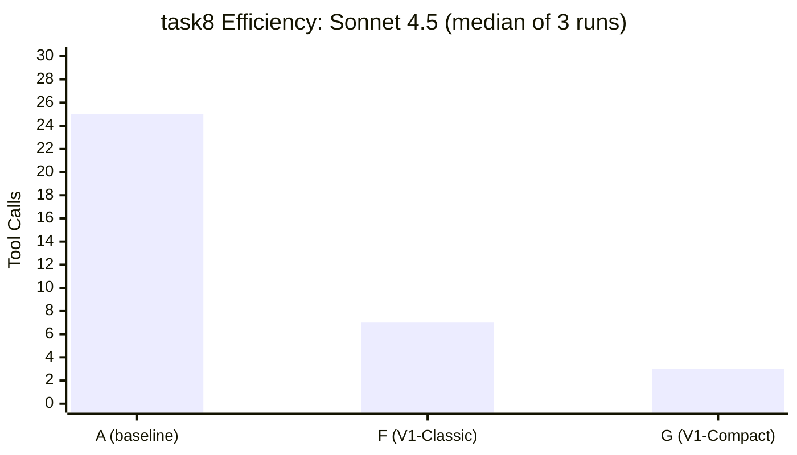

# How ChangeDown Is Benchmarked

These are exploratory findings from early benchmarking, not confirmatory evidence. Sample sizes are small (1--3 runs per cell). Two models were tested. The benchmarks measured agent editing efficiency and accuracy across different interaction surfaces (each surface is a distinct interface an agent uses to read and edit a tracked file; see [glossary](glossary.md)) -- they did not measure the protocol's primary value proposition, which is human-reviewable change traces with attached reasoning.

## What We Measured and Why

ChangeDown provides multiple ways for an AI agent to interact with a tracked file. We call each way a **surface**. The benchmark suite tests 8 surfaces (A through H) that represent different levels of integration with the ChangeDown tracking protocol, from no protocol at all (raw editing) to full hash-addressed change tracking:

| Surface | Description |
|---------|-------------|
| A | Raw file editing (baseline/control -- no protocol) |
| B | MCP Classic -- early protocol surface using [Model Context Protocol](glossary.md) (pre-V1) |
| C | MCP Compact (early, pre-V1) |
| D | CLI |
| E | Decided view (agent sees clean prose with change-status flags) |
| F | V1-Classic (`old_text`/`new_text` with [footnotes](glossary.md)) |
| G | V1-Compact (hash-addressed coordinates (`at`+`op`) with [footnotes](glossary.md)) |
| H | Patch wrapper |

Across these surfaces, 10 task types range from simple rename (task1) to deep copy-editing (task8). Two models have real benchmark data: **Claude Sonnet 4.5** (Anthropic) and **Minimax M2.5** (Minimax, free tier).

The question: does the tracked-changes [protocol](glossary.md) help, hurt, or have no effect on agent editing quality and efficiency -- specifically, do protocol surfaces preserve accuracy while reducing tool calls, output tokens, and wall-clock time? The surfaces that use the protocol (B--H) introduce overhead -- the agent must call propose/review tools via the [MCP](glossary.md) server instead of writing files directly. The benchmark measures whether the structure and feedback that the protocol provides compensate for that overhead.

## The Headline: task8 (Deep Copy-Edit)

task8 is the cleanest benchmark cell. A 169-line Kubernetes Observability Guide has 32 seeded errors (the Sonnet assertion set checks 31 of them; the expanded Minimax set checks all 32) across 6 categories: spelling, grammar, redundancy, version numbers, capitalization, and formatting. There is no existing CriticMarkup in the fixture, so Surface A faces no confound from parsing markup. There is no multi-author history, so no surface benefits from prior proposals. Every surface starts from the same clean document.

### Sonnet 4.5 (3 runs per surface)

Source: `packages/benchmarks/results/sonnet-task8-2026-02-27/`, `sonnet-task8-var1/`, `sonnet-task8-var2/`

| Surface | Tools | Output Tokens | Duration | Quality |
|---------|-------|---------------|----------|---------|
| A (baseline) | 25--27 | 7,470--7,818 | 149--173s | 29/31 (93.5%, single verified run) |
| F (V1-Classic) | 7--10 | 5,131--6,661 | 109--123s | 31/31 (100%, single verified run) |
| G (V1-Compact) | 3 (every run) | 2,226--2,340 | 46--52s | 30/31 (96.8%, single verified run) |

Quality scores are from the original Opus-verified run. Variance run quality was not independently verified -- see [Limitations](#limitations). Efficiency numbers (tools, tokens, duration) are from `benchmark-report.json` files in each result directory and are deterministic. Token counts are output tokens only; input token counts are not tracked. A surface that batches changes into fewer calls reduces output tokens but increases input tokens per call (the server returns more context per response). Total cost comparison requires input token data that these benchmarks do not collect.

### Minimax M2.5 (3--4 runs per surface)

Source: `packages/benchmarks/results/minimax-task8-2026-02-27/`, `minimax-task8-postfix-run1/`, `minimax-task8-postfix-run2/`, `minimax-task8-postfix-run3/`; `docs/research/2026-02-27-minimax-m2.5-benchmark-investigation.md`

| Surface | Tools | Duration | Quality |
|---------|-------|----------|---------|
| A (baseline) | 21--27 | 157--190s | 32/32 (100%) |
| G (V1-Compact) | 4--30 | 60--268s | 32/32 (100%) |

The Minimax fixture uses 32 seeded errors (the assertion set was expanded after the initial Sonnet runs). All Minimax runs achieved 100% quality regardless of tool count or duration.

### What the task8 data shows



**G uses 8x fewer tool calls and completes 3.1x faster than A** (Sonnet medians: 3 tools / 51s vs 25 tools / 158s; ratios rounded). G is perfectly stable on Sonnet -- 3 tool calls on every single run: one read, one propose (batching all changes), one review.

**F achieved perfect accuracy in its single verified run** (31/31) **while running 1.3x faster than A** (Sonnet medians: 7 tools / 120s vs 25 tools / 158s). F is the only surface that caught all 31 errors in its verified run, including heading capitalizations that both A and G missed. Whether this reflects a systematic F advantage or run-to-run variance is unknown at N=1.

**Minimax achieves 100% quality regardless of surface** -- the protocol does not degrade accuracy. The protocol does affect efficiency: G's best Minimax run used 4 tools in 60s, but G's worst used 30 tools in 268s. The variance is driven by a hash-parsing issue described in [What We Found Along the Way](#what-we-found-along-the-way).

**G is perfectly stable on Sonnet but high-variance on Minimax.** Three Sonnet runs: 3 tools each. Four Minimax runs on G: 4, 9, 13, 30 tools. The protocol's compact addressing scheme (`LINE:HASH` coordinates) appears to reward strong spatial parsing and penalize models that struggle with it, though the comparison is between exactly two models.

## The Broader Pattern

Source: `docs/research/2026-02-27-sonnet-afg-sweep-findings.md`, `docs/research/2026-02-25-v1-protocol-comparison-benchmark-findings.md`

Across all tasks tested on Sonnet 4.5 (single-run except task8, all quality scores single-observation):

| Task | A (baseline) | F (V1-Classic) | G (V1-Compact) | Notes |
|------|-------------|----------------|-----------------|-------|
| task1 (rename) | 96% | 96% | 100% (content) | Minor issues on each surface; G is 2.7x faster |
| task2 (audit) | 6/6 | 6/6 | 6/6 | All surfaces find all issues; F has highest fix quality |
| task3 (restructure) | 2.5--4/4 | 4/4 | 3/4 (ceiling) | G fails one subtask on all 3 attempts (different subtask each time); A is stochastic |
| task4 (review) | 3/3 | 3/3 | 3/3 | Protocol surfaces complete review in 4--5 tools vs A's 15 |
| task5_mixed (copy-edit) | 20/20 | 18/20 | 18/20 | A benefits from visible CriticMarkup in fixture (confound); F and G quality not independently verified |
| task8 (deep edit) | 29/31 | 31/31 | 30/31 | See headline section |

These are single-run results except task8 (3 runs). Treat as indicative, not definitive.

**Confound: task5_mixed.** The task5_mixed fixture contains existing CriticMarkup as literal text. Surface A sees this markup as editable text and benefits from it as editing targets. Surfaces F and G parse through the protocol layer, which transforms the markup before presenting it. The 20/20 vs 18/20 result measures a fixture artifact, not a protocol difference. This cell should be excluded from surface comparisons or re-run on a clean fixture.

### Patterns

**F ([Classic protocol](glossary.md)) is the most reliable.** No quality failures observed across all tasks on Sonnet (N=1 per task except task8). 100% accuracy on the cleanest benchmark (task8, N=1 verified). Slightly more tool calls and tokens than G, but never spirals. F's `old_text`/`new_text` interface gives agents natural disambiguation context -- the verbosity is a feature, not overhead.

**G ([Compact protocol](glossary.md)) is most efficient when it works.** task8 in 3 tools / 46--52s is notable. But G has known weaknesses: task3 (structural restructuring) hits a 3/4 quality ceiling across all 3 attempts, and task5_v2 produced 0, 25, and 6 corrections across 3 Sonnet runs -- extreme variance from a server hospitality problem where unhelpful error messages caused the agent to quit. (Source: `docs/research/2026-02-27-sonnet-afg-sweep-findings.md`, G-task5_v2 failure analysis.)

**A (baseline) is competitive on accuracy in these tasks** but consistently the slowest and most token-hungry. A's real disadvantage is efficiency (2--3.6x more tools than F depending on task), not accuracy. On task5_mixed, A actually outperforms F and G (20/20 vs 18/20) because it benefits from seeing CriticMarkup syntax in the fixture as literal editing targets -- a confound, not a protocol advantage.

**Review tasks (task4) show the clearest protocol advantage (N=1).** Tracked-changes surfaces complete review in 4--5 tool calls vs A's 10--15 (10 with git-diff variant, 15 with original CriticMarkup-parsing variant). The protocol provides the review context (what changed, who proposed it, why) that A must reconstruct from raw diffs.

## What We Found Along the Way

The benchmarks functioned as a debugging tool as much as a measurement tool. Each discovery led to a concrete fix or a filed issue.

### Hash `05` attractor

Source: `docs/research/2026-02-27-minimax-m2.5-benchmark-investigation.md`, Finding 2

Every blank line in a tracked file hashes to `05` (the xxHash32 of the empty string). In the 169-line task8 fixture, ~55 lines share this hash. When Minimax M2.5 tries to extract the hash for a content line like `2:a6`, it sometimes latches onto the adjacent blank line's `3:05` instead. This is stochastic -- same model, same input, different outcomes across runs. The error inflated G-surface tool counts from 4 (best case) to 30 (worst case, pre-fix) on Minimax. Sonnet was unaffected. The root cause is protocol-level: blank-line hashes create a statistical attractor that penalizes models with weaker spatial parsing.

### Compaction death spiral

Source: `docs/research/2026-02-27-post-friction-fix-benchmark-results.md`, Findings 2 and 4

When overlapping substitutions on the same line are accepted and [settled](glossary.md), the compaction logic can duplicate text. The agent sees the duplicate, tries to fix it, which creates another substitution on the same line, which after acceptance creates more duplicates. In one Minimax run on task5_v2, this spiral consumed 31 of 37 tool calls -- **84% of all tool usage** was spent fighting a server-side compaction bug, not performing actual edits. The bug has been identified and is tracked for fix.

### String-encoded arrays

Source: `docs/research/2026-02-27-minimax-m2.5-benchmark-investigation.md`, Finding 1

Minimax M2.5 serialized the `changes` parameter as a JSON string (`"[{...}]"`) instead of a native JSON array (`[{...}]`). The MCP server's type check silently rejected the batch. The agent recovered by retrying one change at a time -- 21 individual calls instead of 1 batch. Fixed by adding a `JSON.parse` fallback for string-encoded arrays (commit `298f8ad6`).

### Server hospitality problems

Source: `docs/research/2026-02-27-sonnet-afg-sweep-findings.md`, G-task5_v2 failure analysis

Error messages like "Text not found in the file. Check for Unicode differences..." read as system failures rather than actionable guidance. In one Sonnet run on task5_v2 via G-surface, this caused the agent to conclude all work was already done and quit -- 0 corrections on a task it can solve. The error message did not distinguish "your proposed old_text does not match anything" from "the file has no content." Friction logging from these benchmark runs drove error message rewrites across the MCP server.

## Limitations

This section is intentionally longer and more prominent than the headline findings. The numbers above are interesting, not conclusive. They were collected during active protocol development, not as a controlled experiment.

**Quality verification gap (partially resolved).** An automated verification system (`verify.ts`) now scores agent output against golden-answer files with regex-pattern matching per assertion. Two bugs in the initial implementation were discovered through benchmark analysis and fixed (commit `79b437a7`): (1) `findMarkdownFile()` picked `golden.md` (the answer key) instead of the agent's output, causing correction scoring to check golden against itself (always 100%); (2) amend-decision scoring required `accepted` status, but `amend_change` keeps changes in `proposed` status. All historical task5_v2 and task4 quality scores were inflated and have been corrected in `benchmark-report.json` files. task8 scores were unaffected (no golden.md in task8 fixtures). Variance run quality remains single-observation for pre-verify runs.

**Small N.** Most task-by-surface cells have N=1. Only task8 has 3 runs per surface on Sonnet, and 3--4 runs per surface on Minimax. Every other number in the "Broader Pattern" table is a single observation. One bad run does not mean a surface fails; one good run does not mean it works. Most of the comparative claims in this document rest on exactly one observation per cell.

**Two models.** Sonnet 4.5 and Minimax M2.5. The findings are not generalizable without replication on other models. The Minimax data shows that model capability is the primary accuracy lever (Minimax reaches 100% on task8 regardless of surface) but also shows model-specific failure modes (hash attractor) that are invisible on Sonnet.

**Prompt asymmetry.** Each surface receives a task prompt optimized for its workflow -- the A-surface prompt describes raw editing; the G-surface prompt describes hash-addressed coordinates. Efficiency differences partially measure prompt quality, not surface capability. Quality differences are also affected: a prompt that says 'fix all errors' versus 'propose corrections' primes different levels of thoroughness. A fairer comparison would use identical instructions with surface-specific appendices, which is not yet implemented.

**No reviewability measurement.** The protocol's stated value is human-reviewable change traces with attached reasoning. No benchmark task measures this. The benchmarks measure agent efficiency (tool calls, tokens, duration) and accuracy (errors found/fixed). Whether the resulting change traces are actually useful to a human reviewer is unmeasured -- no user study, informal evaluation, or external reviewer feedback has been collected.

**Not independent.** The benchmark authors are the protocol designers. There are no pre-registered hypotheses, no independent evaluation, and no blinding. The benchmarks were designed alongside the protocol, several benchmark failures led directly to protocol fixes, and some benchmark runs occurred on different versions of the server code -- useful for engineering, problematic for claims of objectivity. All surface prompts (B through H) were iteratively tuned by the protocol designers until runs succeeded; there is no adversarial or independent prompt design.

## Why Both Protocols Ship

The benchmark data supports shipping both the [Classic and Compact protocols](glossary.md) rather than choosing one.

**Classic (F)** achieved the highest reliability across all tasks tested. No quality failures observed on Sonnet (N=1 per task except task8). 100% accuracy on the cleanest benchmark (task8, single verified run). The `old_text`/`new_text` interface carries natural disambiguation context and requires no spatial parsing from the agent. It uses more tokens and tool calls than Compact, but the overhead is predictable. Classic is configured via `[protocol] mode = "classic"` in [`.changedown/config.toml`](glossary.md).

**Compact (G)** achieved the highest efficiency in the tested scenarios. On task8, it used ~8x fewer tool calls and completed ~3x faster than the baseline. The hash-addressed `at`+`op` interface is concise and rewards capable models. It requires stronger spatial parsing and is less forgiving of server-side edge cases. Compact is configured via `[protocol] mode = "compact"`.

The choice is a project-level configuration decision, not a capability progression. A team can start with Classic for reliability, switch to Compact for throughput on dense editing workloads, or stay on Classic permanently. The protocol mode does not affect the change record -- both produce the same [footnotes](glossary.md), the same discussion threads, the same accept/reject workflow. No other tracked-changes tool for AI agents was benchmarked -- the comparison is protocol-vs-baseline, not protocol-vs-competitors. If competing approaches exist, they were not evaluated.

The real value of tracked changes -- reasoning in [footnotes](glossary.md), cross-agent deliberation, human-reviewable change traces -- is not what these benchmarks measure. But the benchmarks demonstrate that the protocol did not degrade accuracy in these tests, and on dense tasks, it made agents substantially faster.

## Reproducing These Results

The benchmark harness is open source in `packages/benchmarks/`. To run a single trial:

```bash
npm run build
cd packages/benchmarks && npm run build
WORKFLOW=G MODEL=your-model node dist/harness/run-trial-cli.js
```

Set `WORKFLOW` to a surface letter (A through H). Set `MODEL` to an OpenCode-compatible model identifier. Results land in a timestamped directory under `packages/benchmarks/results/`. To verify quality scores against the assertion files:

```bash
npx tsx packages/benchmarks/harness/verify.ts --results <results-dir> --all
```

The verifier regex-matches seeded errors against golden answer files, computes per-category accuracy breakdowns, and detects regressions (unexpected line differences vs golden). Assertion definitions: `packages/benchmarks/fixtures/<task>/assertions.json`. Golden files exist for task4, task5, and task8.

Prerequisites: Node.js 20+, an OpenCode-compatible API key, and the ChangeDown plugin installed (for surfaces B through H). The harness creates isolated temp workspaces with their own git repos; runs do not modify the source tree.
