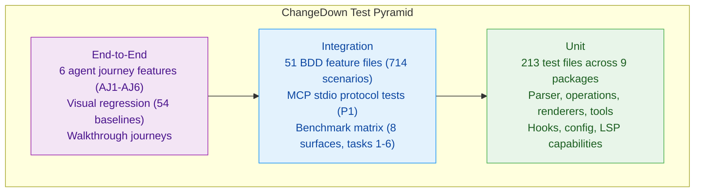

# How ChangeDown Is Tested

ChangeDown is a change-tracking protocol where changes carry not just *what* changed but *why*. The testing strategy follows the same principle: tests carry not just *what passed* but *why it matters* -- through BDD scenarios written in the language of the domain, backed by technical assertions across every layer. See [Glossary](glossary.md) for term definitions.

> **Quick numbers:** 51 BDD features (714 scenarios, 3,051 steps) | 213 test files across 9 packages | 87% aggregate line coverage | 54 visual-regression baselines | No CI pipeline -- all tests run locally.

## Philosophy

Three principles guide the test suite:

**Test like agents think.** The primary test layer uses Behavior-Driven Development (BDD) -- tests written as plain-English scenarios that describe what the system does from the perspective of its users (humans and AI agents alike). For example: an agent proposes a change, another agent reviews it, a human settles the result. The test reads the same way. These scenarios are written in a format called Gherkin (the "Given/When/Then" structure shown in the showcase below).

**Validate through all layers.** A change travels from raw text through the parser (which reads the markup), into an internal data structure, through operations (accept, reject, settle), out via the tools that agents call (see [MCP](glossary.md)), and into the editor. Each layer has its own tests. The BDD scenarios verify complete journeys across all of them.

**Environment over instruction.** Tests verify that the right guardrails are in place -- [hooks](glossary.md) redirect edits, [configs](glossary.md) enforce policy, tracking headers mark which files are managed -- not just that individual functions return correct values. The system's correctness depends on the environment being set up correctly, and the tests verify that.

## BDD Features -- The Specification Layer

The BDD suite is the main test layer. It contains 51 feature files -- each one a collection of scenarios that describe a specific behavior. In total: 714 scenarios covering 3,051 individual steps. Behind the scenes, 786 step definitions (in `features/steps/`) translate each plain-language step into code that runs against the real system.

### Feature Categories

| Category | Files | Scenarios | What they cover |
|----------|-------|-----------|----------------|
| Core (C1-C26) | 26 | ~540 | Parser, operations, renderers, hashline coordinates |
| Operations (O1-O8) | 8 | ~55 | MCP tool surfaces: propose, review, read, amend, settle, batch |
| Engine (E1-E5) | 5 | ~40 | Config resolution, scope, author enforcement, session, guide |
| Hooks (H1-H4) | 4 | ~54 | Policy engine, batch wrapper, ID allocator, edit tracker |
| Journeys (AJ1-AJ6) | 6 | ~23 | End-to-end agent workflow scenarios |
| Protocol (P1) | 1 | 5 | MCP stdio smoke tests |
| Smoke | 1 | 1 | Quick health check |

### Showcase: Multi-Agent Deliberation (AJ3)

The journey features test complete workflows from start to finish. The scenario below (from `features/journeys/AJ3-multi-agent-deliberation.feature`) shows three AI agents with different roles -- architect, security reviewer, and performance analyst -- working together to propose, debate, and resolve a single change:

```gherkin
Scenario: Three agents propose and cross-review
  # Agent A proposes
  When agent "ai:architect" proposes changing "PostgreSQL" to "CockroachDB"
    with reasoning "Need horizontal scaling"
  Then ct-1 is created by ai:architect

  # Agent B comments with concern
  When agent "ai:security" responds to ct-1 thread
    with "CockroachDB has different encryption-at-rest defaults. Verify compliance."
    label "issue"
  Then the footnote has a discussion entry by ai:security

  # Agent C comments with data
  When agent "ai:performance" responds to ct-1 thread
    with "Benchmarks show 2x latency for cross-region queries. Consider the trade-off."
    label "thought"
  Then the footnote has 3 entries total (reasoning + 2 responses)

  # Cross-author amendment is blocked
  When agent "ai:security" tries to amend ct-1
  Then the response is an error (cross-author amendment blocked)

  # Original author amends based on feedback
  When agent "ai:architect" amends ct-1 to "CockroachDB with encryption-at-rest enabled"
  Then the amended text is reflected

  # Consensus reached
  When agent "ai:security" approves ct-1
  And agent "ai:performance" approves ct-1
  Then the footnote contains 2 approval entries
  And the footnote status is "accepted"
```

This single scenario exercises five parts of the system at once: reading and writing change markup, the tools agents use to propose and review changes (see [MCP](glossary.md)), the rule that only the original author can amend their own proposal, the discussion threading and approval tracking in footnotes (see [Glossary](glossary.md)), and the status progression from "proposed" to "accepted." All of that is captured in one readable test.

## Technical Layers

The test pyramid has 213 test files across 9 packages, using four frameworks chosen for their runtime characteristics:

### Frameworks

| Framework | Packages | Why |
|-----------|----------|-----|
| **Mocha** (CJS) | core, lsp-server | Synchronous tests for the parser and LSP; c8 coverage |
| **Vitest** (ESM) | cli, mcp-server, hooks-impl, opencode-plugin, cursor-preview, benchmarks | Fast ESM-native runner; @vitest/coverage-v8 |
| **@vscode/test-cli** (Electron) | vscode-extension | Tests run inside a real VS Code instance |
| **Cucumber.js** | features/ (cross-package) | BDD scenarios with tsx loader, HTML reporting |

### Per-Package Inventory

| Package | Test Files | Framework | What is covered |
|---------|-----------|-----------|-----------------|
| `packages/core` | 35 | Mocha | Parser (two-pass delimiter scan + footnote merge), accept/reject/settle operations, three-zone renderer, hashline coordinates, view projections |
| `changedown-plugin/mcp-server` | 76 | Vitest | All 7 MCP tools, both protocol modes (classic + compact), author enforcement, batch operations, session state, error handling |
| `packages/vscode-extension` | 30 | @vscode/test-cli | Decorator (12 types), smart view, code actions, code lens, comment API, TreeView panel, SCM provider, walkthrough |
| `packages/cli` | 22 | Vitest | CLI commands (status, diff, settle, publish) + engine layer shared with MCP server |
| `changedown-plugin/hooks-impl` | 22 | Vitest | PreToolUse/PostToolUse/Stop hooks, policy modes (strict/safety-net/permissive), batch wrapping |
| `packages/lsp-server` | 13 | Mocha | Semantic tokens, diagnostics, code actions, code lens, hover, document links |
| `packages/cursor-preview` | 7 | Vitest | Cursor Lexical editor bridge |
| `packages/opencode-plugin` | 6 | Vitest | OpenCode AI platform integration |
| `packages/benchmarks` | 2 | Vitest | Harness validation |

**What is not tested.** The `config-types` package has no tests (it exports TypeScript type definitions only). The Neovim plugin (`packages/neovim-plugin/`, ~1,400 lines of Lua) is feature-complete but has zero automated tests. The Sublime Text plugin has only 9 parser tests. These packages are explicitly marked as beta or experimental in the project's maturity labeling.
### Coverage

Coverage is collected via c8 (Mocha packages) and @vitest/coverage-v8 (Vitest packages), both producing lcov format. A merge script (`merge-coverage.mjs`) aggregates results from 6 packages into a unified `coverage/lcov.info`. Current aggregate line coverage across instrumented packages: 87%.

This is an observed measurement, not an enforced threshold -- there is no CI gate that fails the build if coverage drops. The highest-coverage packages are the ones closest to the protocol boundary: core (parser, operations) and mcp-server (tool surfaces).

## Human Flow Verification

### Visual Regression

54 golden baseline PNG screenshots in `packages/vscode-extension/src/test/visual/golden/` verify the editor's visual output. The pipeline:

1. Tests launch a real VS Code instance with known content and theme.
2. Screenshots are captured at specific editor states (markup mode, smart view, unfold, cursor positions, moves, light/dark themes).
3. `pixelmatch` compares each screenshot against its golden baseline with a 0.5% pixel tolerance threshold.
4. Any difference above threshold fails the test and produces a diff image.

Categories covered: insertion/deletion/substitution rendering, smart view hide/reveal, comment unfold, multi-line changes, move operations (purple decorations), adjacent changes, highlight+comment combinations, and theme variants (light and dark).

Update baselines after intentional visual changes with `npm run test:visual:update` in the extension package.

### Walkthrough and Journey Tests

The VS Code extension ships a 5-step interactive walkthrough (welcome, project configuration, author identity, hands-on practice, deeper resources). Journey tests verify the full walkthrough experience programmatically:

- `runJourneys.ts` -- end-to-end journey orchestration
- `walkthroughJourney.ts` -- walkthrough-specific flows
- `journeyHelpers.ts` -- shared test utilities
- Evidence collection in `test/journeys/evidence/` -- screenshots and state dumps captured at each step for debugging failures

These tests run inside a live VS Code Electron process, exercising the full stack from UI interaction to LSP communication to file system changes.

### Example Documents

Two example documents serve as both user-facing demos and implicit integration tests:

- `examples/getting-started.md` -- interactive demo with 4 tracked changes, used by the walkthrough
- `examples/api-caching-deliberation.md` -- a complex multi-agent deliberation scenario showing three agents debating API caching strategy

## Multi-Surface Benchmarks

ChangeDown exposes the same protocol through multiple surfaces -- different ways agents interact with tracked files. The benchmark harness (`packages/benchmarks/`) measures agent behavior across all of them.

### Surfaces

| Surface | Code | Description |
|---------|------|-------------|
| A | Baseline git | No protocol -- raw git diff as control group |
| B | MCP Classic | `propose_change` with old_text/new_text |
| C | MCP Compact | `propose_change` with LINE:HASH coordinates + op grammar |
| D | CLI | `sc` commands (status, diff, settle, publish) |
| E | Decided view | `changes` view with P/A flags |
| F | V1-Classic | V1 protocol surface, classic mode |
| G | V1-Compact | V1 protocol surface, compact mode |
| H | Patch wrapper | Patch-based change submission |

### Task Types

The benchmark harness defines 10 task types representing real editing workflows. Tasks 1-6 have been run across surfaces A-H (with some gaps); tasks 7-10 have fixtures and prompts but no results yet:

| Task | Fixture | What it tests |
|------|---------|---------------|
| task1-rename | Variable/term rename | Consistent multi-site replacement |
| task2-audit | Editorial audit | Reading comprehension + targeted changes |
| task3-restructure | Document restructure | Large-scale reordering |
| task4-review | Change review | Review + accept/reject decisions |
| task5-copyedit | Copyediting | Fine-grained prose improvements |
| task6-triage | Change triage | Review decisions on multiple proposals |
| task7-amend-cycle | Amend workflow | Propose-feedback-amend loop |
| task8-deepedit | Deep structural edit | Multi-paragraph rewrite |
| task9-disambiguate | Ambiguity resolution | Clarifying vague language |
| task10-multifile | Multi-file changes | Cross-file consistency |

The benchmark matrix (8 surfaces x 10+ tasks) produces structured results in `results/` with per-run `summary.json`, `tool-calls.md`, and before/after file snapshots. This data drives the analysis in [How ChangeDown Is Benchmarked](how-changedown-is-benchmarked.md).

### Friction Logging

Benchmark runs include real-time friction logging (`docs/research/2026-02-27-live-agent-friction-log.md`) -- documenting every point where an agent struggles, misinterprets, or takes an unexpected path. These logs feed directly back into protocol design improvements.

## Test Pyramid



**Unit tests** (bottom) verify individual functions: the parser produces correct `ChangeNode[]` from CriticMarkup, operations transform the IR correctly, renderers project the right view, tools validate inputs.

**Integration tests** (middle) verify cross-component behavior: BDD scenarios exercise propose-review-settle workflows through the full stack, protocol tests verify MCP stdio communication, benchmarks measure behavior across surfaces.

**End-to-end tests** (top) verify complete user experiences: journey features simulate multi-agent deliberation from proposal through consensus, visual regression confirms the editor renders correctly, walkthrough tests verify the onboarding flow.

## Running the Tests

```bash
# Build workspace packages (required before first test run)
npm run build

# BDD -- the primary layer, start here
npm run test:cucumber

# Per-package (for focused iteration)
npm run test:core          # Mocha -- parser, operations, renderers
npm run test:cli           # Vitest -- CLI commands + engine
npm run test:mcp           # Vitest -- MCP server (76 test files)
npm run test:hooks         # Vitest -- hook handlers
npm run test:ext           # @vscode/test-cli -- VS Code extension (~25s)
npm run test:lsp           # Mocha -- LSP server

# Full suite
npm test                   # All workspace packages
npm run test:all           # Above + mcp + hooks

# Visual regression
cd packages/vscode-extension
npm run test:visual        # Compare against golden baselines
npm run test:visual:update # Update baselines after intentional changes
```

Filtering: `--grep 'pattern'` works for Mocha and Vitest packages. VS Code extension: `npx vscode-test --grep 'pattern'`. Vitest: `npx vitest run --grep 'pattern'`.

### Prerequisites

- **Node.js** 18 or later (tested on 18 and 24)
- **npm** 9+ (ships with Node 18)
- **Platform:** macOS and Linux. Windows is not tested.
- **VS Code extension tests** require a display server (or Xvfb on headless Linux)
- **Visual regression tests** produce platform-specific baselines; the golden images in the repo are macOS-generated

### CI Status

There is no CI pipeline configured. All tests are run locally by contributors. This means there is no automated gate preventing regressions on merge -- test discipline is enforced by convention, not infrastructure. For teams evaluating adoption, this is the most significant testing gap: the suite is comprehensive, but nothing enforces that it stays green.
# Read /tmp/rehead/38a50a1087f6041c.txt instead of re-running
