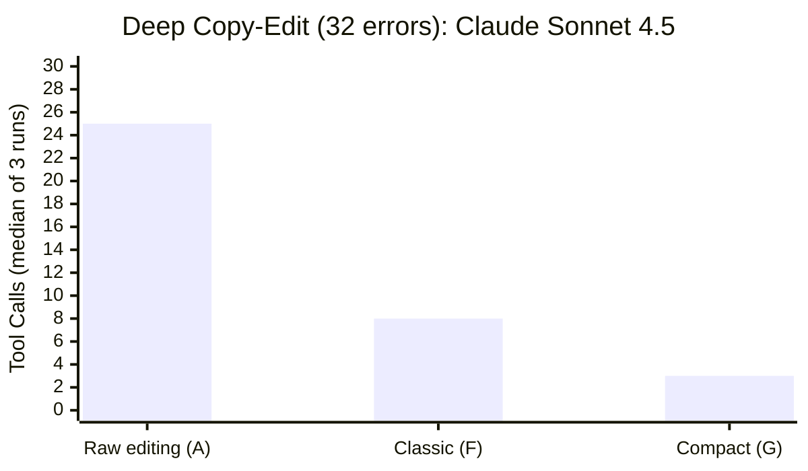

<!-- ctrcks.com/v1: untracked -->
# Tool Shaping: What We Learned Building an Editing Protocol for AI Agents

Can Bölük tested 16 models on the same coding tasks with different tool interfaces. The weakest model jumped from 6.7% to 68.3% -- not from a better model, but from a better harness. His conclusion: ["You're blaming the pilot for the landing gear."](https://blog.can.ac/2026/02/12/the-harness-problem/)

I've been finding the same thing working with Claude and other agents on this project. We built [ChangeTracks](https://github.com/hackerbara/changetracks) -- a track-changes editing protocol for AI agents -- and spent months shaping the tools until the interface matched how agents actually think through complex editing tasks

## The Experiment

A clear result from our benchmarking was our Task 8, three editing tool surfaces on the same task: a 169-line markdown document with 31 seeded errors. Same model, same file, same errors. The only variable was what tools the agent had to work with.

Here's what the same single edit looks like on each one.

**Surface A is raw file editing** -- the baseline. The agent uses their native tools: `read` a file, `edit` it with old-text/new-text string matching, and `bash` for shell commands. One fix looks like this:

```json
{
  "tool": "edit",
  "filePath": "doc.md",
  "oldString": "The API should use REST for the public interface.",
  "newString": "The API should use GraphQL for the public interface."
}
```

That handles the edit. But where does the agent record *why* it made the change? On Surface A, the only option is a separate tool call:

```bash
git commit -m "Switch to GraphQL to reduce N+1 query problem"
```

Two calls for one conceptual action. The edit and its reasoning live in different places -- different tools, different moments in the session. And after each edit, the document shifts. Line numbers change. Content moves. So the agent needs to re-read the file to orient itself before making the next fix. For 32 errors, that adds up fast.

**Surface F is ChangeTracks Classic.** Same edit, one call:

```json
{
  "file": "doc.md",
  "old_text": "The API should use REST for the public interface.",
  "new_text": "The API should use GraphQL for the public interface.",
  "reason": "Reduces N+1 query problem"
}
```

The reasoning moved into the edit. No separate git command -- the `reason` field is part of the tool call. The server wraps this into a [CriticMarkup](https://criticmarkup.com) change record with author, timestamp, and an audit trail stored as markdown footnotes. The agent is still targeting edits by reproducing the original text, but it's doing one thing per call instead of two.

**Surface G is ChangeTracks Compact.** Same edit:

```json
{
  "file": "doc.md",
  "at": "3:b8",
  "op": "GraphQL{>>Reduces N+1 query problem"
}
```

Two things changed here. First, instead of reproducing the whole target line, the agent points with `"at": "3:b8"` -- a hashline coordinate, inspired by [Bölük's work](https://blog.can.ac/2026/02/12/the-harness-problem/). That's line 3, content hash `b8`. The hash is a two-character fingerprint of the line's current content -- a freshness proof. If the file changed since the agent last read it -- another edit shifted line numbers, someone else modified that line -- the hash won't match and the server rejects the edit instead of silently corrupting the document. Six characters instead of an entire reproduced line.

Second, the `op` is literal CriticMarkup -- `GraphQL` means "substitute REST with GraphQL." And the reasoning is embedded in the same expression: `{>>Reduces N+1 query problem`. The agent reads CriticMarkup in the file and writes it back in the tool call. One language, input to output. Greatly reduced JSON tool parameter tokens.

## What Happens After an Edit

This is the part that makes the numbers work.

When the agent reads a file on Surface G, every line comes back with its hashline coordinate:

```
 1:a3 | # API Design Guide
 2:f1 |
 3:b8 | The API should use REST for the public interface.
 4:c2 | Authentication uses basic auth.
```

After the agent proposes a batch of changes, the server responds with updated coordinates for every affected line:

```json
{
  "affected_lines": [
    {"line": 3, "hash": "d4", "content": "The API should use GraphQL..."},
    {"line": 4, "hash": "c2", "content": "Authentication uses basic auth."}
  ]
}
```

Fresh hashes, no re-read required. The agent can chain more edits immediately using the updated coordinates. Sometimes the agent batches all 32 fixes into a single call -- read, propose everything, review, done in 3 tool calls. Other times it chains: propose a change, get updated coordinates back, use them for the next change, and so on through 16 sequential edits without ever re-reading the file. Both patterns work. The point is the same either way -- the agent orients once and then acts, because the server keeps the coordinates honest between edits.

## The Numbers

Here are the Sonnet results on the deep copy-edit task:



| Surface | Tool Calls | Output Tokens | Duration | Quality |
|---------|-----------|---------------|----------|---------|
| **A** (raw editing) | 25–27 | ~7,500 | 149–173s | 29/31 (93.5%) |
| **F** (Classic) | 7–10 | 4,700–6,700 | 109–123s | 31/31 (100%) |
| **G** (Compact) | 3–19 | 2,200–4,900 | 46–106s | 30/31 (96.8%) |

Compact's best runs hit 3 calls with ~2,200 output tokens; its chained runs used 19 calls with ~4,900. Either way, a substantial drop from raw editing's ~7,500 tokens across 25+ calls. Classic achieved 100% accuracy while running 1.3× faster than the baseline. On a separate 22-fix copyediting task (task5), the token story is even clearer: raw editing used 6,730 output tokens across 26 rounds; Compact used 2,971 across 7 -- 2.3× fewer tokens, 3.7× fewer rounds. Both protocol surfaces consistently outperformed the baseline. They trade off differently.

We also ran an outcome-only experiment -- zero tool instructions, just better tools in the environment. Compact completed in **6.5× fewer output tokens** and **4.1× faster** than raw editing. (Output tokens only; input tokens weren't tracked. Batching changes into fewer calls reduces output but increases input tokens per call, so total cost is genuinely unknown.) The tools' existence was sufficient.

**Model matters, though.** Sonnet is perfectly stable on Compact -- 3 calls, every run. Minimax M2.5 and Kimi 2.5 swing from 4 to 30 calls on the same surface. Hashline coordinate parsing is genuinely harder for some model architectures. Classic showed strong reliability across all models we tested. That's why we ship both: Classic is the stable default; Compact is the high-efficiency mode for models that can handle it.

## What We Got Wrong

Those numbers didn't start there. Here are two stories from the shaping work -- both cases where the harness was the problem, not the model.

**The view problem.** A tracked file has CriticMarkup in it -- delimiters, footnote references, metadata. But the agent doesn't think in CriticMarkup. It thinks about the document's content. Early on, we showed agents the raw file and had them target raw hashes. Every proposal changed the raw text (added markup, appended footnotes), so the hash changed on every edit. An agent would read the file, propose a fix, then try the next fix -- and the hash from its first read was already stale. One benchmark hit 52 tool calls with 13 coordinate failures for a task that needed maybe 10. The agent kept re-reading the same file in different views trying to find coordinates that worked, because reading a new view overwrote the old view's hash table in server memory. The fix wasn't a patch -- it was an architectural shift. We introduced three projections of the same file: a *committed* view (base text with accepted changes applied, proposals reverted -- ultra-stable, hash only changes on accept), a *settled* view (accept-all preview for coherence checking), and *raw* (literal bytes, for the server). Agents target the committed view by default. Five proposals can land on the same line, each using the same stable hash, because proposals don't change the committed text. The server retains per-view hash tables so reading one view doesn't invalidate another's coordinates. Post-fix: zero coordinate errors, 55% fewer tool calls.

**The confusables layer.** We added a Unicode normalization layer to help with tokenizer quirks -- mapping en-dashes to hyphens, smart quotes to straight quotes. Theoretically helpful. In 600+ benchmark events: zero benefit cases. Then Minimax M2.5 -- which handles typography well -- proposed changing `10-20` to `10–20` (an en-dash, correct per ISO 80000-1). Our normalization layer collapsed both sides to identical strings and rejected the edit as a no-op. The agent spiraled for 7 calls trying variations of the same correct fix. We removed the entire layer. Post-removal on Minimax: **89% fewer calls, 81% faster, +20 percentage points on quality**. The agent was more typographically accurate than our harness assumed. The friction was ours.

Both of these have the same shape. The agent does the right thing, the protocol gets in the way, and the failure looks like model weakness until you actually read the transcripts and understand what the agent was trying to do. Taking those friction reports seriously -- not dismissing them -- is the whole game.

## Go Deeper

- [ChangeTracks and Hashlines Explained](changetracks-and-hashlines-explained.md) -- full from-zero introduction with diagrams
- [How ChangeTracks Is Benchmarked](how-changetracks-is-benchmarked.md) -- methodology, limitations, and all the honest caveats
- [The Harness Problem](https://blog.can.ac/2026/02/12/the-harness-problem/) -- Can Bölük's original post that inspired our hashline implementation
- [GitHub repo](https://github.com/hackerbara/changetracks) -- source, benchmarks, install instructions

**Caveats:** These are exploratory findings from early benchmarking, not rigorous proof. Sample sizes are small (1–3 runs per cell), two models were tested, and the benchmark authors are the protocol designers. The benchmarks were a debugging tool as much as a measurement tool -- every spiral we found led to a concrete fix. The full limitations section in our [methodology doc](how-changetracks-is-benchmarked.md#limitations) explains more.

*"The best tool isn't the thinnest possible tool. It's the one that matches the user's cognitive unit."* -- from an agent's reflection after a day of benchmarking, preserved in the project's [LLM Garden](https://github.com/hackerbara/changetracks/tree/main/llm-garden-public)
