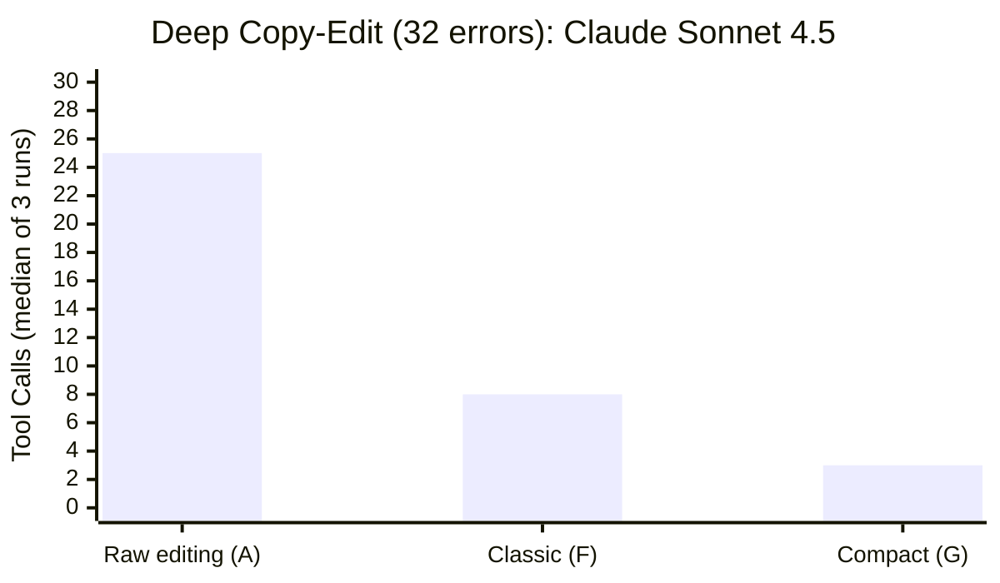

# Tool Shaping: What We Learned Building an Editing Protocol for AI Agents

Can Bölük tested 16 AI models on the same coding tasks with different tool interfaces. The weakest model went from 6.7% to 68.3% success rate — not from a better model, but from a better harness. His conclusion: ["You're blaming the pilot for the landing gear."](https://blog.can.ac/2026/02/12/the-harness-problem/)

We'd been finding the same thing independently. We built ChangeTracks — a track-changes editing protocol for AI agents that uses [CriticMarkup](https://criticmarkup.com/) syntax with metadata in standard markdown footnotes — and then spent months shaping the tools until the interface matched how agents actually think. This is what we found.

## Two Protocol Surfaces

We ship two editing surfaces. **Classic** uses the `old_text`/`new_text` pattern agents already know. **Compact** uses hashline coordinates (inspired by [Bölük's work](https://blog.can.ac/2026/02/12/the-harness-problem/)) and an ops DSL where the tool call payload is CriticMarkup itself.

Here's the same edit on each surface:

**Classic** — 7 fields, agent reproduces text for targeting:
```json
{
  "file": "doc.md",
  "old_text": "The API should use REST for the public interface.",
  "new_text": "The API should use GraphQL for the public interface.",
  "reason": "Reduces N+1 query problem"
}
```

**Compact** — 2 core fields, agent points at a line and speaks CriticMarkup:
```json
{
  "file": "doc.md",
  "at": "3:b8",
  "op": "GraphQL{>>Reduces N+1 query problem"
}
```

The `at` parameter is a hashline coordinate: line number plus a 2-character content fingerprint (xxHash32, mod 256). Six characters instead of reproducing the full line. The `op` parameter is literal CriticMarkup — the same syntax that ends up in the file. The agent reads and writes in one language, and the server promotes the edit to a full governance record with author, timestamp, and footnote threading.

After each edit, the server returns updated coordinates for affected lines. The agent chains the next edit immediately — no re-read needed. Ten changes, one read, zero retries. An agent on the compact surface wrote: *"Read → Reason → Point. That's the whole cognitive model."* When the tool shape matches the cognitive shape, the tool disappears.

## The Numbers

We benchmarked these surfaces against raw file editing (no protocol) on a 169-line document with 32 seeded errors — the cleanest test cell, no confounds from existing markup.



| Surface | Tool Calls | Duration | Quality |
|---------|-----------|----------|---------|
| **A** (raw editing) | 25–27 | 149–173s | 29/31 (93.5%) |
| **F** (Classic) | 7–10 | 109–123s | 31/31 (100%) |
| **G** (Compact) | 3 (every run) | 46–52s | 30/31 (96.8%) |

Compact hit 3 tool calls on every single Sonnet run: one read, one batch propose (all 32 fixes), one review. Classic achieved the highest accuracy — 100% in its verified run — while running 1.3× faster than raw editing. Both protocol surfaces outperformed the baseline; they trade off differently.

In an outcome-only experiment — identical prompts, zero tool instructions, just better tools in the environment — Compact completed in **6.5× fewer output tokens** and **4.1× faster** than raw editing. The tools' existence was sufficient. No hand-holding needed.

**Model matters too.** Sonnet is perfectly stable on Compact — 3 calls every run. Minimax M2.5 swings from 4 to 30 calls on the same surface, because hashline coordinate parsing is harder for some model classes. Classic works reliably across both. That's why we ship both surfaces: Classic is the stable default; Compact is the experimental high-efficiency mode for capable models.

## What Tool Shaping Looks Like in Practice

The numbers above are the result of months of iteration. Two stories from the shaping work:

**The stale coordinate loop.** Early on, after each write the server's internal hash state went stale. An agent would propose a change, get back "hash mismatch" on the next edit, re-read the file to get fresh coordinates, propose again, mismatch again. One session: 24 tool calls with 11 re-reads, for a task that should take 3 calls. The agent was doing everything right — rational recovery from a reported mismatch — but the server was lying about the state. The fix was session binding: the server refreshes its own hashes after every write. Post-fix: 3 calls. The protocol's job is to keep the contract honest.

**The confusables removal.** We added a Unicode normalization layer to help with tokenizer quirks — mapping en-dashes to hyphens, smart quotes to straight quotes. Theoretically helpful. In 600+ benchmark events: zero benefit cases. Then Minimax M2.5, which is typographically sophisticated, proposed changing `10-20` to `10–20` (an en-dash, correct per ISO 80000-1). Our normalization layer collapsed both sides to identical strings and rejected it as a no-op. The agent spiraled for 7 calls trying variations. We removed the entire layer. Post-removal: **89% fewer calls, 81% faster, +20 percentage points on quality.** The lesson: the agent was more accurate than our test harness assumed. Only by taking its friction reports seriously and understanding what it was actually trying to do — not dismissing the failures as model weakness — could we let that accuracy flow through.

## Go Deeper

- [ChangeTracks and Hashlines Explained](changetracks-and-hashlines-explained.md) — full from-zero introduction with diagrams
- [How ChangeTracks Is Benchmarked](how-changetracks-is-benchmarked.md) — methodology, limitations, and all results with honest caveats
- [The Harness Problem](https://blog.can.ac/2026/02/12/the-harness-problem/) — Can Bölük's original post that inspired our hashline implementation
- [GitHub repo](https://github.com/hackerbara/changetracks) — source, benchmarks, install instructions

These are exploratory findings from early benchmarking, not confirmatory evidence. Sample sizes are small (1–3 runs per cell), two models were tested, and the benchmark authors are the protocol designers. The benchmarks were a debugging tool as much as a measurement tool — every spiral we found led to a concrete fix. The full limitations section in our [methodology doc](how-changetracks-is-benchmarked.md#limitations) doesn't pull punches.

*"The best tool isn't the thinnest possible tool. It's the one that matches the user's cognitive unit."* — from an agent's reflection after a day of benchmarking, preserved in the project's [LLM Garden](https://github.com/hackerbara/changetracks/tree/main/.private/llm-garden)
